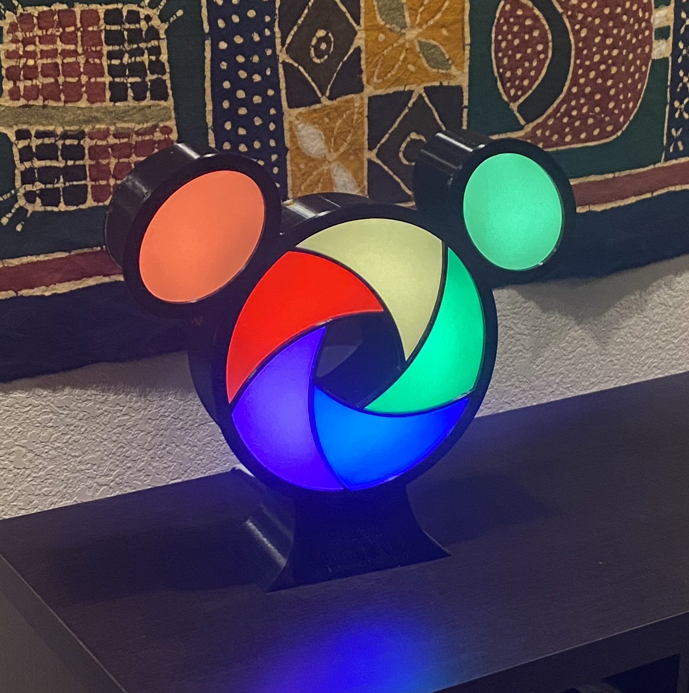
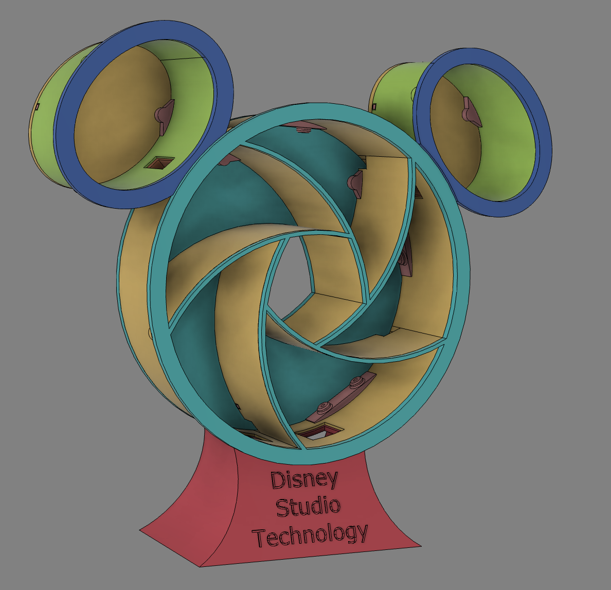
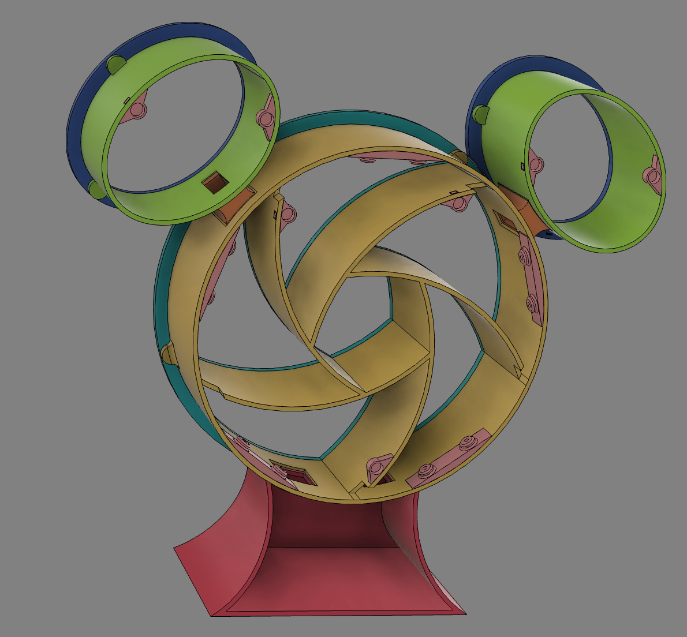

# Studio Technology Logo

A 3D printed model of the Disney Studio Technology Logo.  Uses individually addressible WS2812B LEDs and an ESP32 microcontroller.

## Parts
* vellum (tracing paper) to diffuse the LEDs https://amzn.to/3JvHVWc 
* magnets : Holds the covers on https://amzn.to/3FLLyq5
* LED strips : [AliExpress](https://www.aliexpress.us/item/3256803346805677.html?spm=a2g0o.productlist.main.3.5b1c662cw4Cqmq&algo_pvid=6647c245-5025-4ac6-8a46-d5a0c21a7fab&aem_p4p_detail=202303222032424001414361963480008200775&algo_exp_id=6647c245-5025-4ac6-8a46-d5a0c21a7fab-1&pdp_ext_f=%7B%22sku_id%22%3A%2212000026198147841%22%7D&pdp_npi=3%40dis%21USD%210.76%210.72%21%21%21%21%21%40210213c816795423622153630d071e%2112000026198147841%21sea%21US%21756843278&curPageLogUid=hsQq43Zbb8Rs&ad_pvid=202303222032424001414361963480008200775_2&ad_pvid=202303222032424001414361963480008200775_2)
* ESP32 microcontroller : [AliExpress](https://www.aliexpress.us/item/2251832622236364.html?pdp_npi=2@dis!USD!US%20$6.50!$6.50!!!!!@210312cc16795433189697420ead94!66406327919!btf&_t=pvid:aa3a46dc-cd2d-484b-87b8-e024b54e251d&afTraceInfo=32808551116__pc__pcBridgePPC__xxxxxx__1679543319&spm=a2g0o.ppclist.product.mainProduct&gatewayAdapt=glo2usa&_randl_shipto=US)
* sticker paper : for the inside https://amzn.to/3Zb8XZ1  (or just glue regular white paper)

Parts to Print
* 1x [main frame](./cad/frame.stl)
* 1x [front cover](./cad/studio-logo-face.stl)
* 1x [stand](./cad/studio-logo-stand.stl)
* 1x [L Ear](./cad/ear-L.stl)
* 1x [R Ear](./cad/ear-r.stl)
* 1x [L Ear Cover](./cad/studio-logo-ear-cover-l.stl)
* 1x [R Ear Cover](./cad/studio-logo-ear-cover-r.stl)
* 1x [L Ear Bracket](./cad/studio-logo-ear-brack-l.stl)
* 1x [R Ear Bracket](./cad/studio-logo-ear-brack-r.stl)
* 5x [LED Brackets](./cad/led_bracket.stl)

Optionally print the backs (looks much better with the backs on)
* 1x [back cover](./cad/frame_back.stl)
* 3x [frame back mounts](./cad/main-back-mounts.stl)
* 1x [L ear back](./cad/studio-logo-ear-back-L.stl)
* 1x [R ear back](./cad/studio-logo-ear-back-r.stl)
* 4x [ear back mounts](./cad/ear-back-mount.stl)

Cut sticker paper to fit and line the inside or glue white paper to the inside.  This will help diffuse the light.

Glue magnets into the holes for attaching the front and back covers.  For glueing the magnets I use E6000 https://amzn.to/3ndiRvU .

Cut and glue vellum to the inside of the front cover and ear covers.

Glue the LED strip brackets to the inside of the frame (see cad model photos for guidence)

Wire up the LEDs and ESP32

Mount the LED strips to the brackets (hot glue or screws)

Upload the code to the ESP32

CAD model front

CAD model back

CAD model video
<iframe width="560" height="315" src="https://youtu.be/u030uRLA1Uc" frameborder="0" allow="accelerometer; autoplay; clipboard-write; encrypted-media; gyroscope; picture-in-picture" allowfullscreen></iframe>

